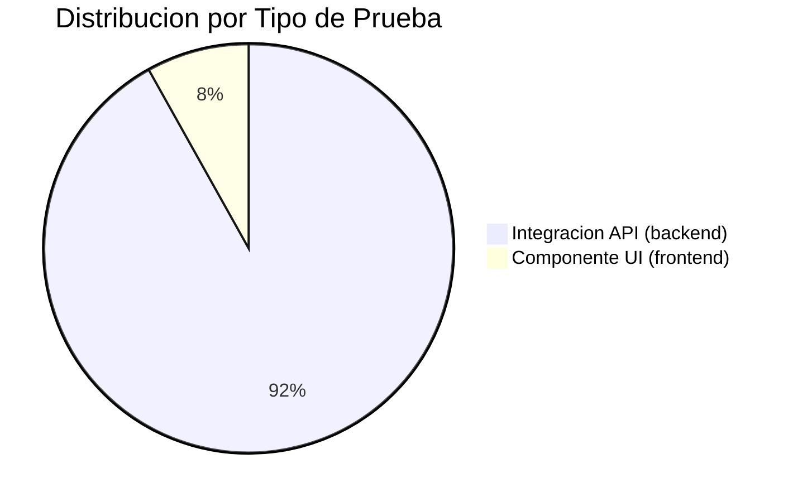
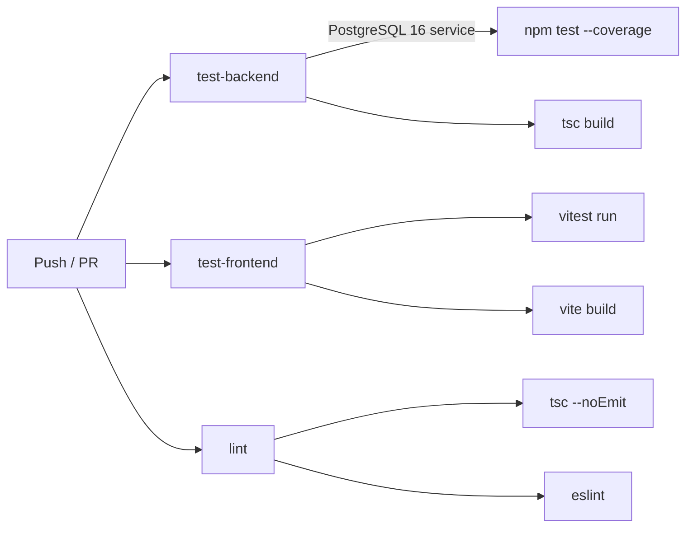

# Analisis de Pruebas -- NEXUS

## Resumen Ejecutivo

| Metrica | Valor |
|---|---|
| **Total de archivos de test** | 6 (5 backend + 1 frontend) |
| **Total de tests** | ~33 |
| **Framework backend** | Jest 29 + Supertest 7 + ts-jest |
| **Framework frontend** | Vitest 4 + Testing Library + jsdom |
| **Base de datos de test** | PostgreSQL 16 (dedicada via `.env.test`) |
| **CI/CD** | GitHub Actions (3 jobs paralelos) |
| **Tipo predominante** | Pruebas de integracion (API) |

---

## 1. Infraestructura de Testing

### Backend ([jest.config.js](file:///c:/Users/USUARIO/Desktop/Nexus/backend/jest.config.js))

| Aspecto | Configuracion |
|---|---|
| Preset | `ts-jest` (TypeScript nativo) |
| Entorno | `node` |
| Workers | `maxWorkers: 1` (ejecucion serial para evitar contension de pool DB) |
| Timeout | 15,000ms (tests de integracion contra DB) |
| Setup | [setup.ts](file:///c:/Users/USUARIO/Desktop/Nexus/backend/tests/setup.ts) -- carga `.env.test` via dotenv |
| Teardown | [globalTeardown.ts](file:///c:/Users/USUARIO/Desktop/Nexus/backend/tests/globalTeardown.ts) -- cierra pool PostgreSQL |
| Coverage | Configurado (`collectCoverageFrom: src/**/*.ts`) |
| DB dedicada | Puerto `5433`, base `nexus_db` via [.env.test](file:///c:/Users/USUARIO/Desktop/Nexus/backend/.env.test) |

### Frontend ([vite.config.ts](file:///c:/Users/USUARIO/Desktop/Nexus/frontend/vite.config.ts))

| Aspecto | Configuracion |
|---|---|
| Framework | Vitest con `globals: true` |
| Entorno | `jsdom` |
| Setup | [setup.ts](file:///c:/Users/USUARIO/Desktop/Nexus/frontend/src/test/setup.ts) -- importa `@testing-library/jest-dom` |
| CSS | Habilitado (`css: true`) |

---

## 2. Inventario Completo de Pruebas

### 2.1 Backend -- Pruebas de Integracion (API)

Todas las pruebas del backend son **tests de integracion**: levantan la app Express real, hacen requests HTTP con Supertest y verifican contra una base PostgreSQL real.

---

#### Suite 1: Autenticacion -- 7 tests
**Archivo:** [auth.test.ts](file:///c:/Users/USUARIO/Desktop/Nexus/backend/tests/auth.test.ts)

| # | Test | Tipo | Endpoint | HTTP | Que valida |
|---|---|---|---|---|---|
| 1 | Registra un nuevo Padawan correctamente | Happy path | `POST /auth/register` | 201 | Registro exitoso, retorna JWT y datos de usuario |
| 2 | Retorna 409 cuando el email ya existe | Validacion negocio | `POST /auth/register` | 409 | Unicidad de email (`EMAIL_DUPLICATE`) |
| 3 | Retorna 400 con datos invalidos | Validacion input | `POST /auth/register` | 400 | Esquema de validacion (`VALIDATION_ERROR`) |
| 4 | Retorna JWT con credenciales validas | Happy path | `POST /auth/login` | 200 | Autenticacion exitosa, emision de JWT |
| 5 | Retorna 401 con contrasena incorrecta | Seguridad | `POST /auth/login` | 401 | Rechazo de credenciales invalidas |
| 6 | Retorna datos del usuario autenticado | Happy path | `GET /auth/me` | 200 | Sesion JWT activa, datos correctos |
| 7 | Retorna 401 sin token | Seguridad | `GET /auth/me` | 401 | Proteccion de endpoint sin JWT |

**Limpieza:** `afterAll` elimina usuarios con email `*@authtest.com`.

---

#### Suite 2: Completacion de OKR -- 6 tests
**Archivo:** [okr.test.ts](file:///c:/Users/USUARIO/Desktop/Nexus/backend/tests/okr.test.ts)
**Endpoint principal:** `POST /api/v1/okrs/:id/complete`

| # | Test | Tipo | HTTP | Regla | Que valida |
|---|---|---|---|---|---|
| 1 | Actualiza OKR con datos validos | Happy path | 200 | -- | Completacion exitosa, estado = "Completado" |
| 2 | Sin JWT | Seguridad | 401 | Auth | `AUTH_REQUIRED` |
| 3 | OKR de otro usuario | Autorizacion | 403 | RN-01 | `FORBIDDEN` -- propiedad del recurso |
| 4 | Estado Pendiente (no EnProgreso) | Maquina de estados | 409 | RN-02 | `INVALID_STATE_TRANSITION` |
| 5 | Rollback ACID | Integridad datos | -- | RN-06 | Verifica que no hay datos parciales si falla la transaccion |
| 6 | Score +12 tras COMMIT | Efecto colateral | 200 | RN-05 | `score_empleabilidad` incrementa exactamente 12 puntos |

**Setup complejo:** Crea usuarios (Padawan, otro usuario, Mentor), perfil de aprendiz, matching, sesion, y OKR en estado `EnProgreso`. Genera 3 JWT distintos para probar diferentes roles/permisos.

> [!NOTE]
> El test de rollback (RN-06) solo verifica el estado previo del OKR pero no fuerza un fallo real mid-transaccion. Es una verificacion parcial de la integridad ACID.

---

#### Suite 3: Sesiones de Mentoria -- 5 tests
**Archivo:** [sessions.test.ts](file:///c:/Users/USUARIO/Desktop/Nexus/backend/tests/sessions.test.ts)

| # | Test | Tipo | UC | Endpoint | HTTP | Que valida |
|---|---|---|---|---|---|---|
| 1 | Crea sesion correctamente | Happy path | UC-12 | `POST /matchings/:id/sessions` | 201 | Creacion de sesion por Jedi |
| 2 | Sin autenticacion | Seguridad | UC-12 | `POST /matchings/:id/sessions` | 401 | Proteccion del endpoint |
| 3 | Marca sesion como Realizada | Happy path | UC-13 | `PUT /sessions/:id` | 200 | Transicion de estado + notas |
| 4 | Cancela sesion programada | Happy path | UC-14 | `DELETE /sessions/:id` | 200 | Estado pasa a "Cancelada" |
| 5 | Retorna historial de sesiones | Happy path | UC-15 | `GET /sessions/my-sessions` | 200 | Lista correcta del Padawan |

---

#### Suite 4: Inteligencia Artificial (Riesgo Abandono) -- 4 tests
**Archivo:** [ia.test.ts](file:///c:/Users/USUARIO/Desktop/Nexus/backend/tests/ia.test.ts)

| # | Test | Tipo | UC | Endpoint | HTTP | Que valida |
|---|---|---|---|---|---|---|
| 1 | Score de riesgo para Padawan | Happy path | UC-25 | `GET /ia/riesgo-abandono` | 200 | Retorna score, nivel, alertas, factores |
| 2 | Sin autenticacion | Seguridad | UC-25 | `GET /ia/riesgo-abandono` | 401 | Proteccion del endpoint |
| 3 | Jedi ve todos los riesgos | Autorizacion | UC-25 | `GET /ia/riesgo-abandono/all` | 200 | Acceso por rol Jedi |
| 4 | Padawan no puede ver todos | Autorizacion | UC-25 | `GET /ia/riesgo-abandono/all` | 403 | Restriccion por rol |

---

#### Suite 5: Notificaciones -- 5 tests
**Archivo:** [notifications.test.ts](file:///c:/Users/USUARIO/Desktop/Nexus/backend/tests/notifications.test.ts)

| # | Test | Tipo | UC | Endpoint | HTTP | Que valida |
|---|---|---|---|---|---|---|
| 1 | Lista notificaciones del usuario | Happy path | UC-26 | `GET /notifications` | 200 | Retorna 3 notificaciones seeded |
| 2 | Sin token | Seguridad | UC-26 | `GET /notifications` | 401 | Proteccion |
| 3 | Conteo de no leidas | Happy path | UC-26 | `GET /notifications/unread-count` | 200 | Exactamente 2 no leidas |
| 4 | Marca una como leida | Happy path | UC-26 | `PATCH /notifications/:id/read` | 200 | `leida = true` |
| 5 | Marca todas como leidas | Happy path | UC-26 | `PATCH /notifications/read-all` | 200 | Conteo posterior = 0 |

> [!NOTE]
> Esta suite crea la tabla `notificacion` con `CREATE TABLE IF NOT EXISTS` directamente en el `beforeAll`, lo cual sugiere que la tabla no existe en todas las migraciones o se agrego despues.

---

#### Suite 6: Vacantes -- 7 tests
**Archivo:** [vacancies.test.ts](file:///c:/Users/USUARIO/Desktop/Nexus/backend/tests/vacancies.test.ts)

| # | Test | Tipo | UC | Endpoint | HTTP | Que valida |
|---|---|---|---|---|---|---|
| 1 | Crea vacante como Admin | Happy path | UC-21 | `POST /vacancies` | 201 | Creacion exitosa |
| 2 | Padawan no puede crear | Autorizacion | UC-21 | `POST /vacancies` | 403 | Restriccion por rol |
| 3 | Lista vacantes activas | Happy path | UC-22 | `GET /vacancies` | 200 | Endpoint publico |
| 4 | Filtra por modalidad | Funcional | UC-22 | `GET /vacancies?modalidad=Remoto` | 200 | Filtro correcto |
| 5 | Padawan se postula | Happy path | UC-23 | `POST /vacancies/:id/apply` | 201 | Postulacion exitosa |
| 6 | Ya esta postulado | Validacion negocio | UC-23 | `POST /vacancies/:id/apply` | 409 | `ALREADY_APPLIED` |
| 7 | Actualiza vacante como Admin | Happy path | UC-24 | `PUT /vacancies/:id` | 200 | Modificacion de datos |
| 8 | Desactiva vacante | Funcional | UC-24 | `PUT /vacancies/:id` | 200 | `activa = false` |
| 9 | Reactiva vacante | Funcional | UC-24 | `PUT /vacancies/:id` | 200 | `activa = true` |

---

### 2.2 Frontend -- Pruebas de Componente

#### Suite unica: LoginPage -- 3 tests
**Archivo:** [LoginPage.test.tsx](file:///c:/Users/USUARIO/Desktop/Nexus/frontend/src/test/LoginPage.test.tsx)

| # | Test | Tipo | Que valida |
|---|---|---|---|
| 1 | Renderiza campos email y password | Renderizado | Presencia de inputs por placeholder |
| 2 | Renderiza branding NEXUS | Renderizado | Texto "NEXUS" e "Iniciar Sesion" |
| 3 | Link a pagina de registro | Navegacion | Texto "Registrate aqui" presente |

**Patron:** Usa `renderWithProviders` que envuelve en `BrowserRouter` + `AuthProvider`.

---

## 3. Clasificacion por Tipo de Prueba

### Desglose por categoria

| Categoria | Cantidad | Porcentaje | Descripcion |
|---|---|---|---|
| **Pruebas de Integracion (API)** | 34 | 92% | Request HTTP real -> Express -> PostgreSQL |
| **Pruebas de Componente (UI)** | 3 | 8% | Renderizado aislado con Testing Library |
| **Pruebas Unitarias** | 0 | 0% | No existen |
| **Pruebas E2E** | 0 | 0% | No existen |
| **Pruebas de Rendimiento** | 0 | 0% | No existen |

### Desglose por aspecto validado

| Aspecto | Tests | Archivos |
|---|---|---|
| Happy path / Funcional | ~18 | Todos |
| Seguridad (autenticacion JWT) | 6 | auth, okr, sessions, ia, notifications |
| Autorizacion (roles/propiedad) | 5 | okr, ia, vacancies |
| Validacion de negocio | 4 | auth, okr, vacancies |
| Integridad transaccional (ACID) | 2 | okr |
| Renderizado UI | 3 | LoginPage |

---

## 4. Pipeline CI/CD

**Archivo:** [ci.yml](file:///c:/Users/USUARIO/Desktop/Nexus/.github/workflows/ci.yml)

El pipeline se ejecuta en `push` a `main`, `develop`, `nexux/**` y en `pull_request` a `main`. Tiene 3 jobs paralelos:

| Job | Que hace | Incluye DB | Coverage |
|---|---|---|---|
| `test-backend` | Migraciones SQL + seed + `jest --coverage` + `tsc build` | Si (PostgreSQL 16 Alpine) | Si |
| `test-frontend` | `vitest run` + `vite build` | No | No |
| `lint` | `tsc --noEmit` (backend) + `eslint` (frontend, no-fail) | No | No |

> [!IMPORTANT]
> El job de lint del frontend tiene `|| true`, lo que significa que los errores de ESLint **no bloquean** el pipeline.

---

## 5. Patron de Datos de Prueba

Todas las suites del backend siguen el mismo patron:

1. **`beforeAll`**: Inserta datos directamente en PostgreSQL via `pool.query` (usuarios, perfiles, matchings, sesiones, OKRs)
2. **Tests**: Hacen HTTP requests con Supertest contra la app Express real
3. **`afterAll`**: Limpia datos insertados filtrando por dominio de email (`@test.com`, `@authtest.com`, `@sessiontest.com`, etc.)
4. **Aislamiento**: Cada suite usa un dominio de email unico para evitar colisiones

> [!WARNING]
> No hay uso de factories, fixtures, ni transacciones envolventes para rollback automatico. Si un test falla a mitad de ejecucion, puede dejar datos huerfanos en la base.

---

## 6. Analisis de Brechas

### Lo que falta

| Tipo de prueba | Estado | Impacto |
|---|---|---|
| **Pruebas unitarias de servicios/controllers** | No existe | No se valida logica de negocio aislada del HTTP y la DB |
| **Pruebas unitarias de middlewares** | No existe | El middleware `auth` solo se prueba indirectamente |
| **Pruebas unitarias de schemas Zod** | No existe | La validacion solo se prueba via HTTP 400 |
| **Pruebas E2E (browser)** | No existe | No hay Cypress, Playwright ni similar |
| **Pruebas de componente (mas paginas)** | Solo LoginPage | Dashboard, OKRs, Sesiones, Vacantes, etc. sin cobertura |
| **Pruebas de rendimiento/carga** | No existe | No hay k6, Artillery ni similar |
| **Pruebas de seguridad** | Parcial | Solo JWT basico; no hay pruebas de SQL injection, XSS, rate limiting, CORS |
| **Test de valor < meta en OKR** | Falta en el codigo | El `pruebas.html` documenta este test (RN-03, 422) pero no esta implementado en `okr.test.ts` |
| **Cobertura de errores de DB** | No existe | No se simula caida de conexion ni timeout de pool |
| **Pruebas de matching/algoritmo** | No existe | El matching padawan-mentor no tiene tests |

### Lo que tiene pero con limitaciones

| Aspecto | Limitacion |
|---|---|
| Test ACID rollback | No fuerza un fallo real mid-transaccion; solo verifica el estado previo |
| Cobertura de coverage | Configurada pero no hay threshold minimo definido |
| Limpieza de datos | Manual por dominio de email; si falla, deja datos sucios |
| Frontend testing | Solo 1 de potencialmente 10+ paginas |
| CI lint | Frontend lint es no-blocking (`|| true`) |

---

## 7. Resumen por Modulo

| Modulo | Backend Tests | Frontend Tests | Cobertura |
|---|---|---|---|
| Autenticacion | 7 | 3 (solo render) | Alta (backend) / Baja (frontend) |
| OKRs | 6 | 0 | Media -- falta RN-03 |
| Sesiones Mentoria | 5 | 0 | Media |
| IA / Riesgo Abandono | 4 | 0 | Media |
| Notificaciones | 5 | 0 | Media |
| Vacantes | 9 | 0 | Alta (backend) |
| Matching | 0 | 0 | Ninguna |
| Dashboard | 0 | 0 | Ninguna |
| Perfil/Onboarding | 0 | 0 | Ninguna |
