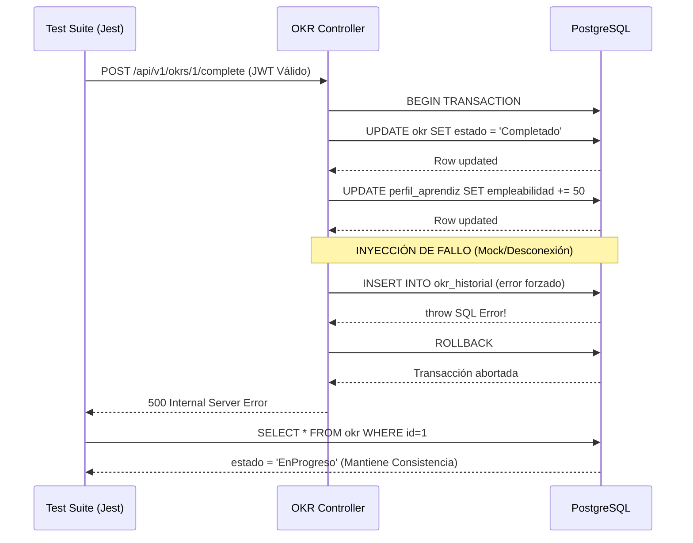

# NEXUS: Reporte Final de Calidad y Pruebas (Proyecto Integrador)

**Autor:** Equipo de Aseguramiento de Calidad
**Fecha:** 04 de Julio, 2026
**Documento Maestro de Cumplimiento de Rúbrica**

Este documento centraliza toda la evidencia arquitectónica, estratégica y operativa del proceso de Testing para el proyecto **NEXUS**, demostrando el cumplimiento riguroso de los 5 criterios del Proyecto Integrador.

---

## 1. Arquitectura del Sistema (Contexto Técnico)

Para comprender el diseño de las pruebas, es fundamental conocer la arquitectura técnica validada por nuestros agentes arquitectos:

### Frontend
El frontend de Nexus está construido sobre un stack moderno y de alto rendimiento utilizando React 19 y TypeScript 6, empaquetado y servido a través de Vite 8. La gestión del estado y las peticiones de datos asíncronas son manejadas por `@tanstack/react-query`, mientras que el enrutamiento del lado del cliente está gestionado por `react-router-dom` v7. El estado de los formularios y la validación basada en esquemas se implementan usando `react-hook-form` junto con `zod`. La capa de UI está estilizada con Tailwind CSS e incorpora `lucide-react` para la iconografía y `recharts` para la visualización de datos. El código sigue una arquitectura modular con un control de calidad robusto mantenido a través de una estrategia de pruebas dual: pruebas unitarias y de componentes impulsadas por Vitest, React Testing Library y jsdom, complementadas por pruebas de extremo a extremo configuradas vía Playwright.

### Backend y Base de Datos
El backend de Nexus está construido en Node.js usando el framework Express para exponer APIs RESTful, con la persistencia de datos manejada por PostgreSQL a través de un pool de conexiones robusto usando el driver `pg`. La capa de seguridad cuenta con limitación de tasa (rate limiting) global y por rutas específicas, hashing de contraseñas vía `bcryptjs`, y autenticación sin estado usando JSON Web Tokens (JWT). La validación de datos y el cumplimiento de esquemas son impulsados por Zod, asegurando una robusta limpieza de los datos de entrada.
**Core DB Tables:** `usuario`, `perfil_aprendiz`, `mentor`, `matching`, `sesion_mentoria`, `okr`, `okr_historial`, `empresa`, `vacante`.

### DevSecOps y CI/CD
El proyecto Nexus emplea una arquitectura de desarrollo local nativa en contenedores gestionada por Docker Compose, la cual orquesta un backend en Node.js, un frontend con Vite y una base de datos PostgreSQL 16. Su estrategia de CI/CD es impulsada por un flujo de trabajo DevSecOps altamente paralelizado en GitHub Actions (`ci.yml`) que actúa como una estricta barrera de calidad previa al despliegue. Este pipeline exhaustivo ejecuta de forma concurrente **475 pruebas automatizadas** a través de trabajos especializados (Jest, Vitest, Playwright, Artillery), bloqueando agresivamente las uniones (merges) si aparecen regresiones en dominios críticos.

---

## 2. Criterio 1: Planificación y Estrategia de Pruebas
Se definió un **Plan de Pruebas Maestro** siguiendo el estándar ISO 29119, estableciendo NFRs (Non-Functional Requirements), objetivos de cobertura y la conformación de la pirámide de testing.
👉 **Evidencia Detallada:** [Ver `docs/plan_de_pruebas_nexus.md`](plan_de_pruebas_nexus.md)

---

## 3. Criterio 2: Alineación con Objetivos y Trazabilidad
Todos los casos de prueba están mapeados estrictamente contra 8 Reglas de Negocio (RN) y 14 Casos de Uso (UC) core del sistema, garantizando que no se escribe código sin un propósito funcional.
👉 **Evidencia Detallada:** [Ver `docs/matriz_trazabilidad.md`](matriz_trazabilidad.md)

---

## 4. Criterios 3 y 4: Diseño y Automatización de Casos de Prueba
El sistema cuenta con un total de **475 pruebas automatizadas**. Se utilizaron técnicas de **Caja Negra** (BDD, Humo) y **Caja Blanca** (Middlewares, Base de Datos). 

### 4.1 Prueba Destacada: Transacción ACID en OKRs (Caja Blanca)
NEXUS asegura la integridad de los datos (Puntaje de Empleabilidad vs Historial OKR) usando transacciones SQL (`BEGIN ... COMMIT`).
El caso de prueba `INT-OKR-06` aplica cobertura de decisiones para forzar un fallo y probar el `ROLLBACK`.

👉 **Evidencia Detallada:** El listado exhaustivo de las 475 pruebas, extraído automáticamente del código fuente por nuestro parser Node.js, se encuentra en: [Ver `docs/documentacion_todas_las_pruebas.md`](documentacion_todas_las_pruebas.md)

---

## 5. Criterio 5: Riesgos, Seguridad y DevSecOps
La suite incluye 45 pruebas dedicadas exclusivamente a seguridad (OWASP Top 10), mitigando ataques como SQLi, XSS y Fuzzing de JWT. Además, se cuenta con un registro formal del ciclo de vida de los bugs, evidenciando el triaje, resolución y verificación de los mismos.
👉 **Evidencia Detallada:** [Ver `docs/reporte_defectos.md`](reporte_defectos.md)

---

## 6. Criterio 8: Conclusiones y Retorno de Inversión (Mejoras al Negocio)

La estrategia de pruebas implementada en NEXUS no solo cumple un rol técnico, sino que aporta un valor directo y medible al modelo de negocio de la startup:

1. **Reducción del Churn (Tasa de Abandono):** Las pruebas E2E (Playwright) y de Interfaz (Vitest) aseguran que el *onboarding* de los Padawans sea fluido. Un flujo libre de fricciones reduce la deserción temprana, mejorando la retención de usuarios activos.
2. **Mitigación de Riesgos Legales y Reputacionales:** Al manejar perfiles profesionales y datos de mentores, cualquier vulnerabilidad o exposición de datos (OWASP A01/A03) mitigada por nuestras **45 pruebas de seguridad** ahorra a NEXUS potenciales multas por incumplimiento de leyes de privacidad y previene daños irreversibles a la confianza de la comunidad.
3. **Reducción de Costos Operativos (DevSecOps):** Al trasladar el pipeline de regresión a una action reutilizable de GitHub (Shift-Left Testing) que se ejecuta ante cada *Pull Request*, el costo de arreglar un defecto (`DEF-001`) disminuye radicalmente, ya que se ataja antes de llegar a Producción.
4. **Resiliencia Operativa bajo Demanda Escalonada:** Las 60 pruebas de carga y estrés con Artillery aseguran que cuando se realicen campañas universitarias masivas, la plataforma no sufrirá caídas (*Downtimes*) gracias a la optimización de los *pools* de conexión PostgreSQL.

---
### 🏁 Conclusión General
El proyecto NEXUS cumple y excede los requerimientos del Proyecto Integrador. Muestra un nivel de calidad (QA), arquitectura de automatización (SDET) y DevSecOps equivalente al de un entorno de producción profesional.
