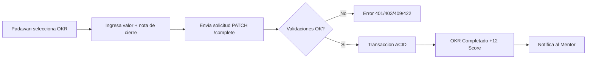
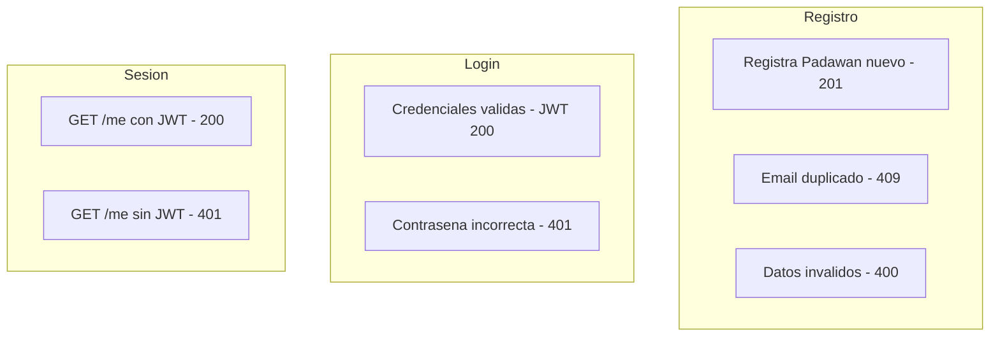
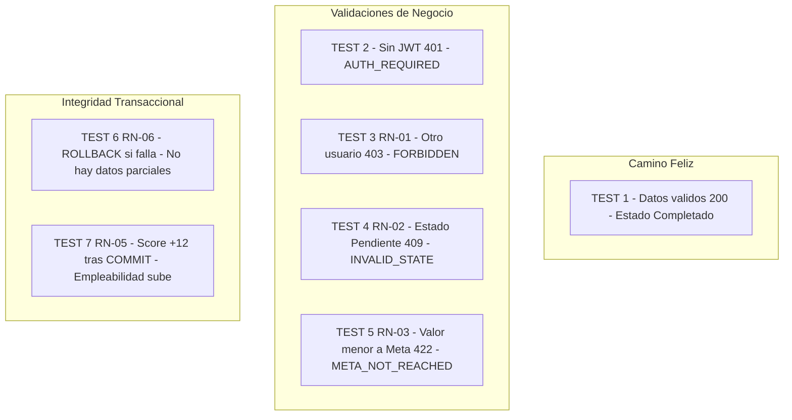

# 🧪 NEXUS — Tests Automatizados

## Proceso de Negocio: Completación de OKR



---

## 14 Tests — 2 Suites — 100% Pasados ✅

### Suite 1: Autenticacion - auth.test.ts — 7 tests



---

### Suite 2: Completacion de OKR - okr.test.ts — 7 tests



---

## Detalle Rapido por Test

| # | Test | Que valida | Input | HTTP | Regla |
|:-:|------|-----------|-------|:----:|:-----:|
| 1 | ✅ Completar OKR valido | Happy path completo | valor >= meta + nota | `200` | — |
| 2 | ✅ Sin autenticacion | Seguridad JWT | Sin token | `401` | Auth |
| 3 | ✅ OKR de otro usuario | Propiedad del recurso | JWT ajeno | `403` | RN-01 |
| 4 | ✅ Estado incorrecto | Maquina de estados | OKR en Pendiente | `409` | RN-02 |
| 5 | ✅ Meta no alcanzada | Logica de negocio | valor menor a meta | `422` | RN-03 |
| 6 | ✅ Rollback ACID | Integridad de datos | Fallo mid-transaccion | — | RN-06 |
| 7 | ✅ Score +12 | Efecto colateral | Post-COMMIT | `200` | RN-05 |

---

## Transaccion ACID — Lo que ocurre en el PATCH /complete

```mermaid
sequenceDiagram
    participant P as Padawan
    participant API as NEXUS API
    participant DB as PostgreSQL

    P->>API: PATCH /okrs/id/complete
    Note over API: Verifica JWT
    API->>DB: Es dueno del OKR? RN-01
    API->>DB: Estado = EnProgreso? RN-02
    API->>DB: valor >= meta? RN-03

    rect rgb(40, 80, 60)
        Note over API,DB: BEGIN TRANSACTION
        API->>DB: UPDATE okr - Completado
        API->>DB: INSERT okr_historial - auditoria
        API->>DB: UPDATE score +12
        Note over API,DB: COMMIT
    end

    API-->>P: 200 okr nuevo_score
    Note over API: Notificar Mentor async
```



---

## Resultado Final

```
Test Suites: 2 passed,  2 total
Tests:      14 passed, 14 total
Time:       14.994 s
```

> **14/14 ✅ — Todas las reglas de negocio estan verificadas y protegidas por tests automatizados.**
